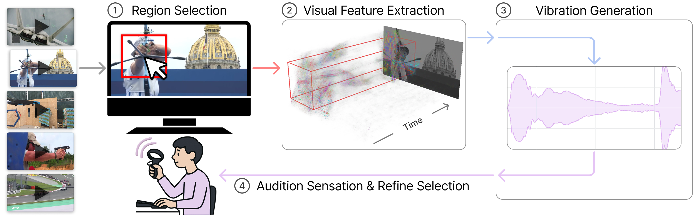

# HapticLens

*Interactive Vibrotactile Haptic Generation from Spatially Localized Video Motion*



## Requirements

- Python 3.11
- CUDA-capable GPU for the CV pipelines (VRAM requirements depend on the input video resolution and number of frames)
- `ffmpeg` and `ffprobe`
- Quest controller playback support is available via the companion [questxr-happlay](https://github.com/kevin-cgc/questxr-happlay) project

## Setup

```bash
uv sync
```

If `ffmpeg` or `ffprobe` are not on `PATH`, set:

```bash
FFMPEG_PATH=/path/to/ffmpeg
FFPROBE_PATH=/path/to/ffprobe
```

## Quick Start

Interactive GUI:

```bash
uv run src/gui.py /path/to/video.mp4 1
```

There is also a primitive batch processing script, that uses fixed extraction regions:

```bash
uv run src/create-dataset-batch.py \
  --input-dir /path/to/input_videos \
  --output-dir /path/to/output_wavs \
  --algorithm phase \
  --extraction-percentages 1.0 0.5 0.25 0.1
```

## Citation (BibTeX)
```
@inproceedings{10.1145/3772318.3790269,
author = {John, Kevin and Seifi, Hasti},
title = {HapticLens: Interactive Vibrotactile Haptic Generation from Spatially Localized Video Motion},
year = {2026},
isbn = {9798400722783},
publisher = {Association for Computing Machinery},
address = {New York, NY, USA},
url = {https://doi.org/10.1145/3772318.3790269},
doi = {10.1145/3772318.3790269},
abstract = {Unlike visual and auditory media, physical sensations are difficult to create and capture, limiting the availability of diverse haptic content. Converting common media formats like video into haptics offers a promising solution, but existing video-to-haptics methods depend on specific characteristics, such as camera motion or predefined actions, and rely on spatial haptic hardware (e.g., motion chair, haptic vest). We introduce HapticLens, an interactive method for creating haptics from video, supported by an open-source GUI and two vision algorithms. Our method works with arbitrary video content, detects subtle motion, and requires only a single vibrotactile actuator. We evaluate HapticLens through technical experiments and a study with 22 participants. Results demonstrate it supports interactive vibration design with high designer satisfaction for its usability and haptic signals’ overall quality and relevance. This work broadens the accessibility of video-driven haptics, offering a practical method to create and experience tactile content.},
booktitle = {Proceedings of the 2026 CHI Conference on Human Factors in Computing Systems},
articleno = {744},
numpages = {21},
keywords = {Haptic Design, Vibrotactile Feedback, Video-to-Haptics, Computer Vision},
location = {
},
series = {CHI '26}
}
```
